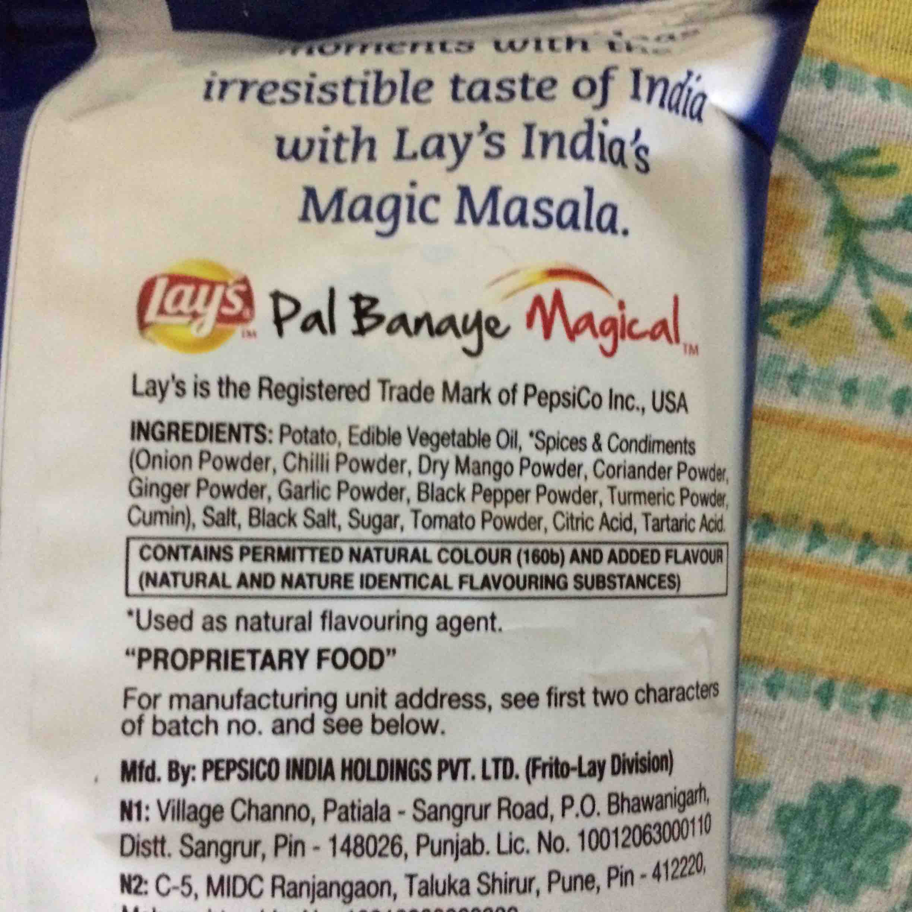

# HalalLens – AI-Powered Food Ingredient Classifier

HalalLens is an AI-powered application that helps users determine whether a food product is **Halal, Haram, or Doubtful** by analyzing its ingredient list. The system uses **Optical Character Recognition (OCR)** to extract text from product labels and compares the detected ingredients with a predefined dataset for classification.

## Features

- Extracts ingredient text from food labels using OCR
- Classifies ingredients as Halal, Haram, or Doubtful
- Uses a CSV-based ingredient database
- Fast and easy-to-use workflow
- Built with Python

## Technologies Used

- Python
- OCR (Optical Character Recognition)
- CSV Dataset
- Artificial Intelligence Concepts

## Project Structure

```text
HalalLens-FYP/
├── README.md
├── requirements.txt
├── constants.py
├── dataset.csv
├── dataset.py
├── main.py
├── ocr.py
├── test.jpg
└── screenshots/
    ├── Screenshot (19).png
    ├── Screenshot (22).png
    ├── authentication.jpeg.jpg
    ├── home.jpeg.jpg
    ├── onboarding.png
    ├── scan_result_1.jpeg.jpg
    ├── scan_result_2.jpeg.jpg
    └── splash.jpeg.jpg
```

## How It Works

## Sample Input



1. Capture or upload an image of a food ingredient label.
2. Extract ingredient text using OCR.
3. Compare extracted ingredients with the ingredient database.
4. Display the classification result:
   - ✅ Halal
   - ❌ Haram
   - ⚠️ Doubtful

## Future Improvements

- Flutter mobile application
- Generative AI integration for smarter ingredient analysis
- Real-time camera scanning
- Larger ingredient database
- Cloud-based API support

## Author

**Isha Saleem**

BS Computer Science Graduate  
The Shaikh Ayaz University, Shikarpur
